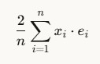
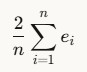

# פונקציות Loss ונגזרותיהן בלמידת מכונה

## מהי פונקציית Loss?

פונקציית Loss (או פונקציית שגיאה/עלות) היא פונקציה המודדת כמה רחוק המודל שלנו מהמטרה האמיתית. ככל שהערך של פונקציית ה-Loss נמוך יותר, כך המודל שלנו מדויק יותר.

בלמידת מכונה, אנחנו משתמשים באלגוריתמים כמו ירידת גרדיאנט כדי למזער את פונקציית ה-Loss, ובכך "ללמד" את המודל להיות מדויק יותר.

## טעות ריבועית ממוצעת Mean Squared Error (MSE)

אחת מפונקציות ה-Loss הנפוצות ביותר היא ה-Mean Squared Error (שגיאה ריבועית ממוצעת).

### הגדרה מתמטית

עבור קבוצה של $n$ תצפיות, כאשר $y_i$ הוא הערך האמיתי ו-Y^i הוא הערך החזוי, ה-MSE מוגדר כך:

$$MSE = \frac{1}{n} \sum_{i=1}^{n} (y_i - \hat{y}_i)^2$$

במילים פשוטות:
1. מחשבים את ההפרש בין הערך החזוי לערך האמיתי לכל נקודה
2. מעלים בריבוע כל הפרש
3. מחשבים את הממוצע של כל ההפרשים בריבוע

### טעות ריבועית ממוצעת MSE ברגרסיה לינארית

ברגרסיה לינארית, המודל שלנו הוא:

$$\hat{y} = mx + b$$

כאשר $m$ הוא השיפוע (slope) ו-b הוא החותך (intercept).

פונקציית ה-MSE במקרה זה היא:

$$MSE(m, b) = \frac{1}{n} \sum_{i=1}^{n} (y_i - (mx_i + b))^2$$

## חישוב הנגזרות (הגרדיאנטים) של MSE

### הקדמה

#### נגזרת ב-∂ וב-d רגיל

#### הסיבות העיקריות להבחנה בין ∂ ל-d:

**1. הבחנה בין סוגי הנגזרות**
* **נגזרת רגילה (d)** משמשת כאשר הפונקציה תלויה במשתנה אחד בלבד.
  * לדוגמה: $\frac{df}{dx}$ עבור פונקציה $f(x)$
  
* **נגזרת חלקית (∂)** משמשת כאשר הפונקציה תלויה ביותר ממשתנה אחד ואנחנו מחשבים את הנגזרת לפי משתנה אחד בלבד, כאשר שאר המשתנים קבועים.
  * לדוגמה: $\frac{\partial f}{\partial x}$ עבור פונקציה $f(x,y,z)$

**2. מניעת בלבול מתמטי**
* הסימון השונה מבהיר למקרא אם מדובר בנגזרת חלקית או מלאה.
* כשיש מספר משתנים, חשוב להבחין איזה סוג של גזירה מתבצע.

**3. משמעות שונה בהקשרים מתקדמים**
* בקלקולוס וקטורי (קלקולוס =חשבון אינפיניטסימלי- כלומר, שינויים קטנים מאוד, הקרובים לאפס) , אנליזה פונקציונלית, ומשוואות דיפרנציאליות חלקיות, יש משמעות מתמטית שונה לשני סוגי הנגזרות.
* הסימון $d$ משמש גם עבור הדיפרנציאל המלא.

#### דוגמה להמחשה:

אם $f(x,y) = x^2y + xy^3$:

* $\frac{\partial f}{\partial x} = 2xy + y^3$
* $\frac{\partial f}{\partial y} = x^2 + 3xy^2$

#### בהקשר לפונקציה שהצגת:

$^2((b + mx) - y)\sum_{i=1}^{n} \frac{1}{n} = f(m,b)$

הנגזרות החלקיות יסומנו:
* $\frac{\partial f}{\partial m}$ - זו הנגזרת לפי $m$
* $\frac{\partial f}{\partial b}$ - זו הנגזרת לפי $b$

כאשר בכל אחת מהנגזרות החלקיות, המשתנה השני נשאר קבוע

### כדי למזער את פונקציית ה-MSE באמצעות ירידת גרדיאנט, אנחנו צריכים לחשב את הנגזרות החלקיות של ה-MSE ביחס לפרמטרים $m$ ו-b.

### הנגזרת ביחס ל-m (השיפוע)

$$\frac{\partial MSE}{\partial m} = \frac{\partial}{\partial m} \left[ \frac{1}{n} \sum_{i=1}^{n} (y_i - (mx_i + b))^2 \right]$$

נפתח את הביטוי:

$$\frac{\partial MSE}{\partial m} = \frac{1}{n} \sum_{i=1}^{n} \frac{\partial}{\partial m} [(y_i - mx_i - b)^2]$$

נשתמש בכלל שרשרת: $\frac{d}{dx}[f(g(x))] = f'(g(x)) \cdot g'(x)$

$$\frac{\partial MSE}{\partial m} = \frac{1}{n} \sum_{i=1}^{n} 2(y_i - mx_i - b) \cdot (-x_i)$$

$$\frac{\partial MSE}{\partial m} = \frac{1}{n} \sum_{i=1}^{n} -2x_i(y_i - mx_i - b)$$

$$\frac{\partial MSE}{\partial m} = \frac{1}{n} \sum_{i=1}^{n} -2x_i(y_i - \hat{y}_i)$$

$$\frac{\partial MSE}{\partial m} = \frac{-2}{n} \sum_{i=1}^{n} x_i(y_i - \hat{y}_i)$$

מכיוון שאנחנו רגילים להגדיר את השגיאה כ Ei = Y^i - Yi נקבל:

$$\frac{\partial MSE}{\partial m} = \frac{2}{n} \sum_{i=1}^{n} x_i(\hat{y}_i - y_i)$$

$$\frac{\partial MSE}{\partial m} = \frac{2}{n} \sum_{i=1}^{n} x_i \cdot e_i$$

וזה בדיוק מה שמחושב בקוד:

```python
dm = (2/n) * np.sum(errors * X)
```

### הנגזרת ביחס ל-b (החותך)

באופן דומה:

$$\frac{\partial MSE}{\partial b} = \frac{\partial}{\partial b} \left[ \frac{1}{n} \sum_{i=1}^{n} (y_i - (mx_i + b))^2 \right]$$

$$\frac{\partial MSE}{\partial b} = \frac{1}{n} \sum_{i=1}^{n} \frac{\partial}{\partial b} [(y_i - mx_i - b)^2]$$

$$\frac{\partial MSE}{\partial b} = \frac{1}{n} \sum_{i=1}^{n} 2(y_i - mx_i - b) \cdot (-1)$$

$$\frac{\partial MSE}{\partial b} = \frac{1}{n} \sum_{i=1}^{n} -2(y_i - mx_i - b)$$

$$\frac{\partial MSE}{\partial b} = \frac{1}{n} \sum_{i=1}^{n} -2(y_i - \hat{y}_i)$$

$$\frac{\partial MSE}{\partial b} = \frac{-2}{n} \sum_{i=1}^{n} (y_i - \hat{y}_i)$$

ושוב, אם נגדיר את השגיאה כ Ei = Y^i - Yi:

$$\frac{\partial MSE}{\partial b} = \frac{2}{n} \sum_{i=1}^{n} (\hat{y}_i - y_i)$$

$$\frac{\partial MSE}{\partial b} = \frac{2}{n} \sum_{i=1}^{n} e_i$$

וזה בדיוק מה שמחושב בקוד:

```python
db = (2/n) * np.sum(errors)
```

## הבנת הקוד לחישוב הגרדיאנטים

```python
n = len(X)
predictions = linear_function(X, m, b)  # חישוב התחזיות על סמך הפרמטרים הנוכחיים
errors = predictions - y               # חישוב השגיאות (ההפרש בין התחזיות לערכים האמיתיים)

# הגרדיאנט עבור השיפוע (m)
dm = (2/n) * np.sum(errors * X)

# הגרדיאנט עבור החותך (b)
db = (2/n) * np.sum(errors)
```

### הסבר מפורט:

1. `n = len(X)` - מספר הדגימות (התצפיות) בקבוצת הנתונים.

2. `predictions = linear_function(X, m, b)` - מחשב את התחזיות של המודל עבור ערכי ה-X בהינתן הפרמטרים הנוכחיים m ו-b. זה מחשב את $\hat{y}_i = mx_i + b$ לכל אחת מהנקודות.

3. `errors = predictions - y` - מחשב את וקטור השגיאות, כלומר את ההפרש בין התחזיות לערכים האמיתיים. זה מחשב את $e_i = \hat{y}_i - y_i$ לכל נקודה.

4. `dm = (2/n) * np.sum(errors * X)` - נחשב את הנגזרת החלקית של MSE ביחס ל-m <br/>
   

6. `db = (2/n) * np.sum(errors)` - נחשב את הנגזרת החלקית של MSE ביחס ל-b  <br/>
   

## תפקיד הגרדיאנטים באלגוריתם ירידת הגרדיאנט

באלגוריתם ירידת הגרדיאנט, אנחנו מעדכנים את הפרמטרים של המודל שלנו בכיוון שמוביל להפחתה בערך של פונקציית ה-Loss:

```python
m = m - learning_rate * dm
b = b - learning_rate * db
```

כאשר:
- `learning_rate` הוא היפר-פרמטר המכתיב את גודל הצעד שאנחנו עושים בכל איטרציה.
- `dm` ו-`db` הם הגרדיאנטים שחישבנו.

על ידי הליכה בכיוון ההפוך של הגרדיאנט (למשל, מחסרים את `dm` מ-`m` במקום להוסיף), אנחנו נעים לכיוון המינימום של פונקציית ה-Loss. זהו העיקרון הבסיסי מאחורי אלגוריתם ירידת הגרדיאנט.

## סיכום

1. פונקציית ה-Loss מודדת את הטעות של המודל שלנו.
2. MSE הוא פונקציית Loss נפוצה ברגרסיה לינארית.
3. הגרדיאנטים של פונקציית ה-Loss מראים לנו את הכיוון של השינוי המהיר ביותר בפונקציה.
4. בירידת גרדיאנט, אנחנו הולכים בכיוון ההפוך של הגרדיאנט כדי למזער את הטעות.
5. הקוד שהצגנו מחשב בדיוק את הגרדיאנטים הללו ומשתמש בהם כדי לעדכן את פרמטרי המודל.
